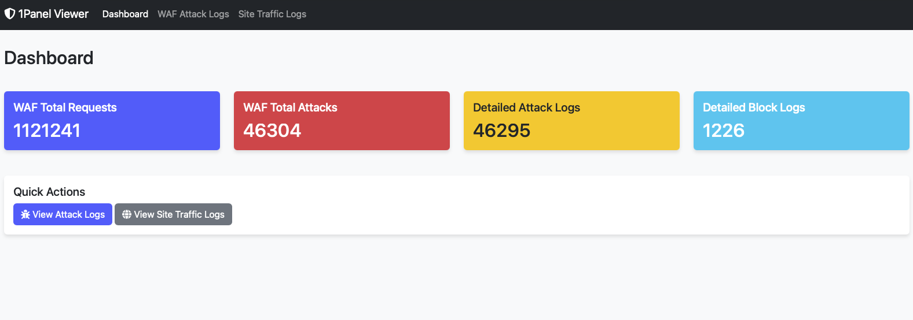

# 1Panel WAF & Logs Viewer

A lightweight, interactive Python Flask-based viewer application to read WAF attack logs and website traffic logs directly from the built-in SQLite database of **1Panel OpenResty WAF**.



This application reads data directly from the 1Panel WAF production directory in *real-time* without the need to copy or duplicate the database. It features a Bootstrap 5 and DataTables-based interface for fast searching, sorting, and pagination, even for tens of thousands of log rows.

## Features

*   **Summary Dashboard:** Displays total requests, attacks, and blocked logs.
*   **WAF Attack Logs Viewer:** View details of attacks blocked by the WAF, complete with IP, *Rule Match*, and the action taken.
*   **Site Traffic Logs Viewer:** View specific *traffic* logs per website (HTTP Status, URI, Response Time, etc.) available in 1Panel.
*   **Real-time Database Access:** Reads the built-in `/opt/1panel/apps/openresty/openresty/1pwaf/data/db` database directly if run on a production server.
*   **HTTP Basic Authentication:** Built-in protection to secure your logs viewer from unauthorized access.

## System Requirements

*   Docker and Docker Compose
*   *Root* access (to allow Docker to mount the 1Panel WAF directory)

## Setup & Deployment (Docker)

This is the recommended way to run the application as it provides isolation and handles the necessary permissions to read 1Panel data via volume mounting.

1. Clone this repository or copy all files into a folder on your server.
2. Copy the environment template to create your `.env` file:
   ```bash
   cp .env.example .env
   ```
3. Configure your `.env` file:
   - `WAF_DATA_DIR`: Set this to the path where 1Panel WAF data is stored (default: `/opt/1panel/apps/openresty/openresty/1pwaf/data`).
   - `APP_PORT`: The port you want to use (default: `5000`).
   - `BASIC_AUTH_USERNAME` & `BASIC_AUTH_PASSWORD`: Set these to secure your logs.
4. Build and start the container:
   ```bash
   docker compose up -d --build
   ```
5. The application will be accessible at `http://your-server-ip:5000`.

## Security & Authentication

To protect your logs from unauthorized access, it is highly recommended to enable HTTP Basic Authentication.

1. Edit the `.env` file in your application directory.
2. Set your desired username and password:
   ```env
   BASIC_AUTH_USERNAME=admin
   BASIC_AUTH_PASSWORD=your_secure_password
   ```
If you leave these variables blank or commented out, the application will be accessible without a password.

## Production Access & Security

**⚠️ IMPORTANT:** Do not expose the application port (e.g., `5000`) directly to the public internet. Use one of the following secure methods:

### 1. Reverse Proxy via 1Panel (Recommended for Public Access)

If you want to access the viewer via a domain name with HTTPS:

1. In 1Panel, go to **Websites > Websites** and click **Create Website**.
2. Select **Proxy** tab.
3. **Primary domain:** Enter your domain (e.g., `waf.yourdomain.com`).
4. **Proxy Protocol:** `http`
5. **Target IP:** `127.0.0.1` (or the server's internal IP).
6. **Target Port:** `5000` (or whatever `APP_PORT` you set in `.env`).
7. **Enable HTTPS/SSL:** Go to the website settings after creation and enable SSL to ensure your Basic Auth credentials are encrypted.

### 2. Access via Tailscale (Secure Private Access)

If you do not want to expose the viewer to the public internet at all (no public domain required):

1. Install Tailscale on your server and your local machine.
2. Access the viewer securely through your browser using your server's Tailscale IP address: `http://100.x.y.z:5000`.
3. This completely hides the application from public network scans while keeping it accessible from your private network.
